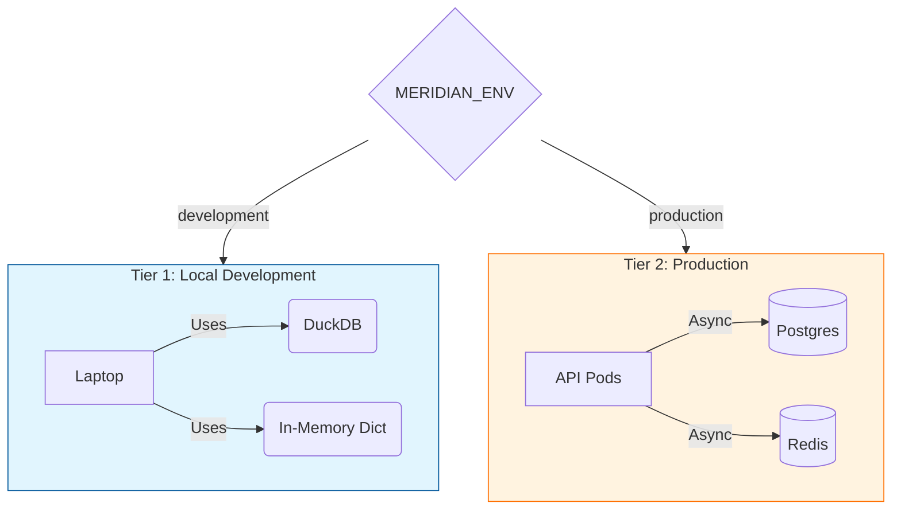
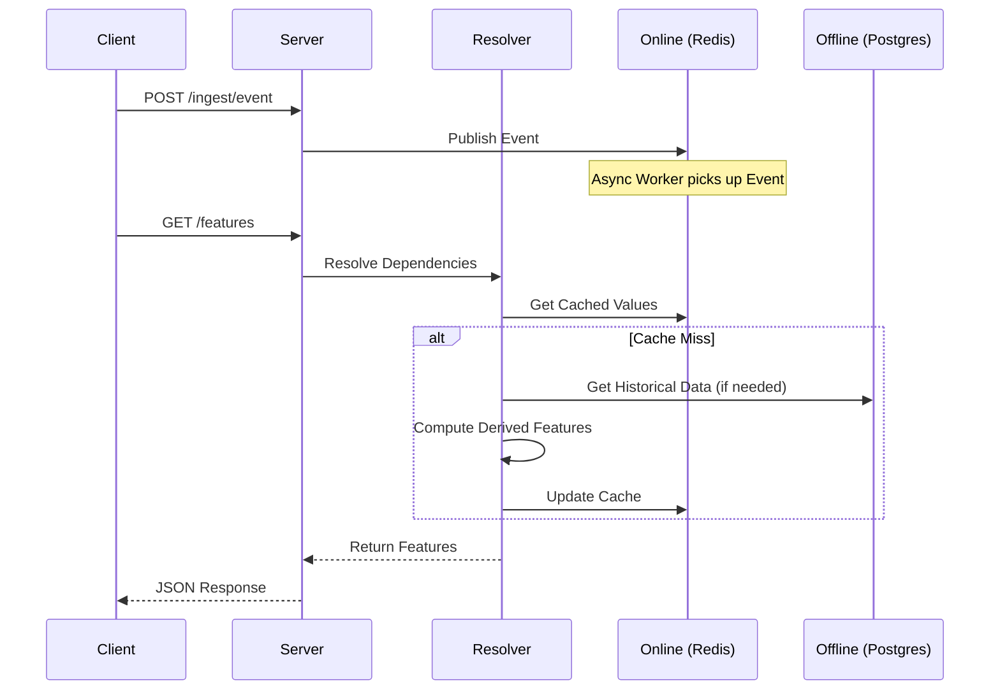

<div align="center">
  <h1>Meridian</h1>
  <h3>The Heroku for ML Features & LLM Context</h3>

  <p>
    <a href="https://pypi.org/project/meridian-oss/"></a>
    <a href="https://github.com/davidahmann/meridian/blob/main/LICENSE"></a>
    <a href="#"></a>
    <a href="#"></a>
  </p>

  <p><b>Define features in Python. Get training data, production serving, and LLM context for free.</b></p>
  <p>Stop paying the infrastructure tax. Meridian takes you from Jupyter to Production in 30 seconds.</p>

  <p><b>🆕 v1.2.0:</b> Context Store for LLMs with RAG, vector search (pgvector), and token budgets.</p>

  <p>
    <b>📚 <a href="https://davidahmann.github.io/meridian/">Documentation</a></b> |
    <b>🤖 <a href="https://davidahmann.github.io/meridian/context-store">Context Store</a></b> |
    <b>🛠️ <a href="docs/unit_testing.md">Testing Guide</a></b>
  </p>
</div>


### ⚡ The 30-Second Quickstart

**Option A: The "I just want to see it work" (Clone & Run)**
```bash
git clone https://github.com/davidahmann/meridian.git
cd meridian
pip install -e ".[ui]"
meridian serve examples/basic_features.py
```

**Option B: The "Builder" (Pip Install)**

1.  **Install Meridian**
```bash
pip install "meridian-oss[ui]"
```

2.  **Create a file named `my_features.py`:**
```python
from meridian.core import FeatureStore, entity, feature
from datetime import timedelta
import random

store = FeatureStore()

@entity(store)
class User:
    user_id: str

@feature(entity=User, refresh=timedelta(minutes=5), materialize=True)
def user_click_count(user_id: str) -> int:
    return len(user_id) + random.randint(0, 100)
```

3.  **Serve it immediately:**
```bash
meridian serve my_features.py
# 🚀 Meridian server running on http://localhost:8000
```

4.  **Query it:**
```bash
curl -X POST http://localhost:8000/features \
  -H "Content-Type: application/json" \
  -d '{"entity_name": "User", "entity_id": "u1", "features": ["user_click_count"]}'
# Output: {"user_click_count": 42}
```

---

### 🚀 Why Meridian?

Most feature stores are built for the 1% of companies (Uber, DoorDash) with platform teams. They require Kubernetes, Spark, and complex microservices.

Meridian is built for the rest of us.

| Feature | The "Old Way" | The Meridian Way |
| :--- | :--- | :--- |
| **Config** | 500 lines of YAML | Python Decorators (`@feature`) |
| **Infra** | Kubernetes + Spark | Runs on your Laptop (DuckDB) |
| **Serving** | Complex API Gateway | `meridian serve file.py` |
| **Philosophy** | "Google Scale" | "Get it Shipped" |

#### Key Features

* **Local-First, Cloud-Ready:** Runs on your laptop with zero dependencies (DuckDB + In-Memory). Scales to production with boring technology (Postgres + Redis).
* **No Magic:** Your code is your config. Explicit caching (`materialize=True`) and explicit refresh logic.
* **Production Reliability:** Built-in circuit breakers, fallback chains (Cache -> Compute -> Default), and Prometheus metrics (`meridian_feature_requests_total`).
* **Self-Healing:** Run `meridian doctor` to instantly diagnose config and connectivity issues.
* **Rich UI & TUI:** Includes a Streamlit dashboard with **Visual Dependency Graphs** and a production-grade Terminal UI for live monitoring.
* **Hybrid Features (v1.1.0):** Mix Python logic (for complex math) and SQL (for heavy joins) in the same API.
* **Point-in-Time Correctness (v1.1.0):** Zero data leakage using `ASOF JOIN` (DuckDB) and `LATERAL JOIN` (Postgres).
* **Write Once, Run Anywhere (v1.1.0):** Switch from Dev to Prod just by setting `MERIDIAN_ENV=production`. No code changes.
* **Context Store for LLMs (v1.2.0):** Full RAG infrastructure with vector search (pgvector), token budgets, and priority-based context assembly.

---

### 🏗️ Architecture

Meridian is designed to grow with you.



**Tier 1: Local Development (The "Wedge")**
* *Perfect for prototyping and single-developer projects.*
* **Offline Store:** DuckDB (Embedded)
* **Online Store:** Python Dictionary (In-Memory)
* **Infra:** None (Just `pip install`)

**Tier 2: Production (The "Standard")**
* *Robust, scalable, and boring.*
* **Offline Store:** Postgres / Snowflake / BigQuery
* **Online Store:** Redis
* **Vector Store:** pgvector (Postgres extension)
* **Infra:** 1x Postgres (with pgvector), 1x Redis, Nx API Pods

### 🔧 Configuration

Meridian uses 12-factor app configuration via Environment Variables.

| Variable | Description | Default |
| :--- | :--- | :--- |
| `MERIDIAN_ENV` | Environment mode (`development` or `production`) | `development` |
| `MERIDIAN_REDIS_URL` | Redis Connection String | `redis://localhost:6379/0` |
| `MERIDIAN_POSTGRES_URL` | Postgres Connection String | `postgresql+asyncpg://...` |
| `MERIDIAN_API_KEY` | Master API Key for Server Authentication | `None` (Public in Dev) |
| `OPENAI_API_KEY` | Required for Vector Embeddings & Context Assembly | `None` |
| `COHERE_API_KEY` | Alternative embedding provider (Cohere) | `None` |
| `MERIDIAN_EMBEDDING_MODEL` | Embedding model for vector search | `text-embedding-3-small` |

---

### 📚 Advanced Usage

#### 1. Context Store & RAG (v1.2.0)
Meridian isn't just for numbers. It's a full **Context Infrastructure** for LLMs.

```python
from meridian.retrieval import retriever
from meridian.context import context, Context, ContextItem

# Index documents (auto-chunks and embeds)
await store.index(index_name="docs", entity_id="doc_1", text="Meridian is awesome...")

# Define retriever for semantic search
@retriever(store, index="docs", top_k=3)
async def search_docs(query: str) -> list[str]:
    pass  # Meridian handles vector search via pgvector

# Assemble context with token budget
@context(store, max_tokens=4000)
async def chat_context(user_id: str, query: str) -> Context:
    docs = await search_docs(query)
    user_prefs = await store.get_feature("user_preferences", user_id)
    return Context(items=[
        ContextItem("You are a helpful assistant.", priority=0, required=True),
        ContextItem(docs, priority=1, required=True),
        ContextItem(f"User prefs: {user_prefs}", priority=2),  # Truncated first
```python
    ])
```

**Debug Context Assembly:**
```bash
# View exactly why documents were included/dropped
meridian context <id>
```

[📖 Full Context Store Documentation →](https://davidahmann.github.io/meridian/context-store)

#### 2. Time Travel
Debug production issues by querying the state of the world *as it was* yesterday.

```python
# Create a context that travels back in time
with time_travel(datetime.now() - timedelta(days=1)):
    # All feature queries in this block return historical values from Postgres
    print(user_click_count("u1"))
```

#### 3. Event-Driven Updates
Meridian listens to your event bus (Redis Streams) to push fresh features instantly.

```python
@feature(entity=User, trigger="transaction_event")
def last_transaction_amount(user_id: str, event: AxiomEvent) -> float:
    return event.payload["amount"]
```

---

### 🔍 Request Lifecycle



---

### 🗺️ Roadmap

* ✅ **Phase 1:** Core API, DuckDB/Postgres support, Redis caching, FastAPI serving, PIT Correctness, Async I/O.
* ✅ **Phase 2 (v1.2.0):** Context Store, RAG infrastructure, pgvector, Event-Driven features, Time Travel.
* 🚧 **Phase 3:** Drift detection, RBAC, and multi-region support.

### 🤝 Contributing

We love contributions! This is a community-driven project. Please read our [CONTRIBUTING.md](CONTRIBUTING.md) to get started.

### 📄 License

Apache 2.0
