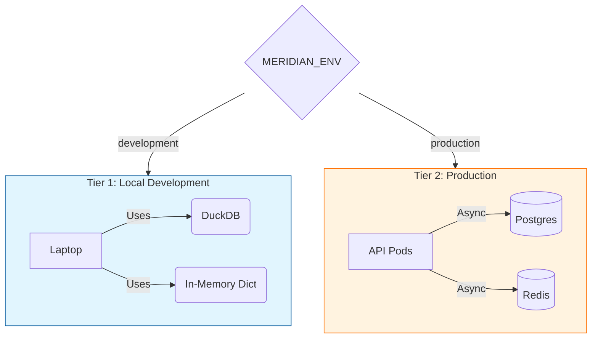

<div align="center">
  <h1>Meridian</h1>
  <h3>The Heroku for ML Features</h3>

  <p>
    <a href="https://pypi.org/project/meridian-oss/"></a>
    <a href="https://github.com/davidahmann/meridian/blob/main/LICENSE"></a>
    <a href="#"></a>
    <a href="#"></a>
  </p>

  <p><b>Define features in Python. Get training data and production serving for free.</b></p>
  <p>Stop paying the infrastructure tax. Meridian takes you from Jupyter to Production in 30 seconds.</p>

  <p>
    <b>📚 <a href="https://davidahmann.github.io/meridian/">Read the Documentation</a></b>
  </p>
</div>


### ⚡ The 30-Second Quickstart

**Option A: The "I just want to see it work" (Clone & Run)**
```bash
git clone https://github.com/davidahmann/meridian.git
cd meridian
pip install -e ".[ui]"
meridian serve examples/basic_features.py
```

**Option B: The "Builder" (Pip Install)**

1.  **Install Meridian**
```bash
pip install "meridian-oss[ui]"
```

2.  **Create a file named `my_features.py`:**
```python
from meridian.core import FeatureStore, entity, feature
from datetime import timedelta

store = FeatureStore()

@entity(store)
class User:
    user_id: str

@feature(entity=User, refresh=timedelta(minutes=5), materialize=True)
def user_click_count(user_id: str) -> int:
    return len(user_id) + random.randint(0, 100)
```

3.  **Serve it immediately:**
```bash
meridian serve my_features.py
# 🚀 Meridian server running on http://localhost:8000
```

4.  **Query it:**
```bash
curl -X POST http://localhost:8000/features \
  -H "Content-Type: application/json" \
  -d '{"entity_name": "User", "entity_id": "u1", "features": ["user_click_count"]}'
# Output: {"user_click_count": 42}
```

---

### 🚀 Why Meridian?

Most feature stores are built for the 1% of companies (Uber, DoorDash) with platform teams. They require Kubernetes, Spark, and complex microservices.

Meridian is built for the rest of us.

| Feature | The "Old Way" | The Meridian Way |
| :--- | :--- | :--- |
| **Config** | 500 lines of YAML | Python Decorators (`@feature`) |
| **Infra** | Kubernetes + Spark | Runs on your Laptop (DuckDB) |
| **Serving** | Complex API Gateway | `meridian serve file.py` |
| **Philosophy** | "Google Scale" | "Get it Shipped" |

#### Key Features

* **Local-First, Cloud-Ready:** Runs on your laptop with zero dependencies (DuckDB + In-Memory). Scales to production with boring technology (Postgres + Redis).
* **No Magic:** Your code is your config. Explicit caching (`materialize=True`) and explicit refresh logic.
* **Production Reliability:** Built-in circuit breakers, fallback chains (Cache -> Compute -> Default), and Prometheus metrics (`meridian_feature_requests_total`).
* **Rich UI & TUI:** Includes a Streamlit dashboard and a production-grade Terminal UI for live monitoring.
* **Hybrid Features (v1.1.0):** Mix Python logic (for complex math) and SQL (for heavy joins) in the same API.
* **Point-in-Time Correctness (v1.1.0):** Zero data leakage using `ASOF JOIN` (DuckDB) and `LATERAL JOIN` (Postgres).
* **Write Once, Run Anywhere (v1.1.0):** Switch from Dev to Prod just by setting `MERIDIAN_ENV=production`. No code changes.

---

### 🏗️ Architecture

Meridian is designed to grow with you.



**Tier 1: Local Development (The "Wedge")**
* *Perfect for prototyping and single-developer projects.*
* **Offline Store:** DuckDB (Embedded)
* **Online Store:** Python Dictionary (In-Memory)
* **Infra:** None (Just `pip install`)

**Tier 2: Production (The "Standard")**
* *Robust, scalable, and boring.*
* **Offline Store:** Postgres / Snowflake / BigQuery
* **Online Store:** Redis
* **Infra:** 1x Postgres, 1x Redis, Nx API Pods

---

### 🗺️ Roadmap

* ✅ **Phase 1 (Now):** Core API, DuckDB/Postgres support, Redis caching, FastAPI serving, PIT Correctness, Async I/O.
* 🚧 **Phase 2:** Drift detection, RBAC, and multi-region support.

### 🤝 Contributing

We love contributions! This is a community-driven project. Please read our [CONTRIBUTING.md](CONTRIBUTING.md) to get started.

### 📄 License

Apache 2.0
