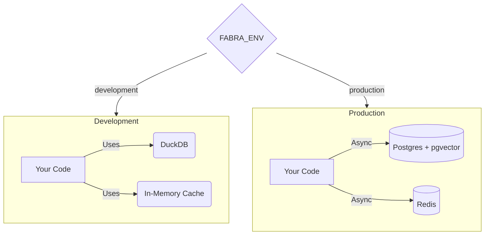

<div align="center">
  <h1>Fabra</h1>
  <h3>The Context Store for LLMs & ML Features</h3>

  <p>
    <a href="https://pypi.org/project/fabra_ai/"></a>
    <a href="https://github.com/davidahmann/fabra/actions/workflows/ci.yml"></a>
    <a href="https://github.com/davidahmann/fabra/security"></a>
    <a href="https://github.com/davidahmann/fabra/blob/main/LICENSE"></a>
    
  </p>

  <br />

  <p><b>Unify RAG pipelines and ML features in a single Python decorator.</b></p>
  <p><i>From notebook prototype to production in 30 seconds. No Kubernetes. No Spark. No YAML.</i></p>

  <br />

  <p>
    <b><a href="https://fabraoss.vercel.app">🎮 Try in Browser</a></b> |
    <b><a href="https://davidahmann.github.io/fabra/">📚 Docs</a></b> |
    <b><a href="https://davidahmann.github.io/fabra/context-store">🤖 Context Store</a></b>
  </p>
</div>

---

## The Problem

You're building an AI app. You need:
- **Structured features** (user tier, purchase history) for personalization
- **Unstructured context** (relevant docs, chat history) for your LLM
- **Vector search** for semantic retrieval
- **Token budgets** to fit your context window

Today, this means stitching together LangChain, Pinecone, a feature store, Redis, and prayer.

**Fabra unifies all of this in one Python decorator.**

---

## The 30-Second Quickstart

```bash
pip install "fabra[ui]"
```

```python
from fabra.core import FeatureStore, entity, feature
from fabra.context import context, ContextItem
from fabra.retrieval import retriever

store = FeatureStore()

@entity(store)
class User:
    user_id: str

@feature(entity=User, refresh="daily")
def user_tier(user_id: str) -> str:
    return "premium" if hash(user_id) % 2 == 0 else "free"

@retriever(index="docs", top_k=3)
async def find_docs(query: str):
    pass  # Automatic vector search via pgvector

@context(store, max_tokens=4000)
async def build_prompt(user_id: str, query: str):
    tier = await store.get_feature("user_tier", user_id)
    docs = await find_docs(query)
    return [
        ContextItem(content=f"User is {tier}.", priority=0),
        ContextItem(content=str(docs), priority=1),
    ]
```

```bash
fabra serve features.py
# Server running on http://localhost:8000
```

**That's it.** No infrastructure. No config files. Just Python.

**Context Accountability (v1.4+):** Every context assembly is tracked with full lineage:

```python
ctx = await build_prompt("user_123", "How do I upgrade?")
print(ctx.id)       # UUIDv7 identifier for replay
print(ctx.lineage)  # Full audit trail: features, retrievers, freshness
```

**Freshness SLAs (v1.5+):** Ensure your AI decisions are based on fresh data:

```python
@context(store, max_tokens=4000, freshness_sla="5m")  # Features must be <5m old
async def build_prompt(user_id: str, query: str):
    tier = await store.get_feature("user_tier", user_id)
    return [ContextItem(content=f"User is {tier}.", priority=0)]

ctx = await build_prompt("user_123", "query")
print(ctx.is_fresh)                    # True if all features within SLA
print(ctx.meta["freshness_violations"])  # Details on any stale features
```

---

## Why Fabra?

| | Traditional Stack | Fabra |
|:---|:---|:---|
| **Config** | 500 lines of YAML | Python decorators |
| **Infrastructure** | Kubernetes + Spark + Pinecone | Your laptop (DuckDB) |
| **RAG Pipeline** | LangChain spaghetti | `@retriever` + `@context` |
| **Feature Serving** | Separate feature store | Same `@feature` decorator |
| **Time to Production** | Weeks | 30 seconds |

### What Makes Fabra Different

**1. One Decorator for Everything**

Other tools make you choose: LangChain for RAG, Feast for features, separate vector DB. Fabra gives you `@feature`, `@retriever`, and `@context` — all wired together, all in Python.

**2. Local-First, Production-Ready**

```bash
# Development (default): DuckDB + In-Memory
FABRA_ENV=development

# Production: Postgres + Redis + pgvector
FABRA_ENV=production
```

Same code. Zero changes. Just flip an environment variable.

**3. Point-in-Time Correctness**

Training ML models? We use `ASOF JOIN` (DuckDB) and `LATERAL JOIN` (Postgres) to ensure your training data reflects the world exactly as it was — no data leakage, ever.

**4. Token Budget Management**

```python
@context(store, max_tokens=4000)
async def build_prompt(user_id: str, query: str):
    return [
        ContextItem(content=critical_info, priority=0, required=True),
        ContextItem(content=nice_to_have, priority=2),  # Dropped if over budget
    ]
```

Automatically assembles context that fits your LLM's window. Priority-based truncation. No more "context too long" errors.

---

## Key Capabilities

### For AI Engineers
- **Vector Search:** Built-in pgvector with automatic chunking and embedding
- **Magic Retrievers:** `@retriever` auto-wires to your vector index
- **Context Assembly:** Token budgets, priority truncation, explainability API
- **Semantic Cache:** Cache expensive LLM calls and retrieval results
- **Context Accountability:** Full lineage tracking, context replay, and audit trails for AI decisions
- **Freshness SLAs:** Ensure data freshness with configurable SLAs and degraded mode handling

### For ML Engineers
- **Hybrid Features:** Mix Python logic and SQL in the same pipeline
- **Event-Driven:** Trigger updates via Redis Streams
- **Observability:** Prometheus metrics, OpenTelemetry tracing
- **Self-Healing:** Circuit breakers, fallback chains, `fabra doctor`

### For Everyone
- **One-Command Deploy:** `fabra deploy fly|cloudrun|ecs|railway|render`
- **Visual UI:** Dependency graphs, live metrics, context debugging
- **Shell Completion:** `fabra --install-completion`

---

## Architecture

Fabra scales from laptop to production without code changes.



---

## Production in 60 Seconds

```bash
# Set environment variables
export FABRA_ENV=production
export FABRA_POSTGRES_URL=postgresql+asyncpg://...
export FABRA_REDIS_URL=redis://...

# Deploy
fabra deploy fly --name my-app
```

[Full Deployment Guide →](https://davidahmann.github.io/fabra/local-to-production)

---

## Roadmap

- [x] **v1.0:** Core Feature Store (DuckDB, Postgres, Redis, FastAPI)
- [x] **v1.2:** Context Store (pgvector, retrievers, token budgets)
- [x] **v1.3:** UI, Magic Retrievers, One-Command Deploy
- [x] **v1.4:** Context Accountability (lineage tracking, context replay, audit trails)
- [x] **v1.5:** Freshness SLAs (data freshness guarantees, degraded mode, strict mode)
- [ ] **v1.6:** Drift detection, RBAC, multi-region

---

## Get Started

```bash
pip install "fabra[ui]"
```

<p align="center">
  <a href="https://fabraoss.vercel.app"><b>Try in Browser</b></a> ·
  <a href="https://davidahmann.github.io/fabra/quickstart"><b>Quickstart Guide</b></a> ·
  <a href="https://davidahmann.github.io/fabra/"><b>Full Documentation</b></a>
</p>

---

## Contributing

We love contributions! See [CONTRIBUTING.md](CONTRIBUTING.md) to get started.

<div align="center">
  <p><b>Fabra</b> · Apache 2.0 · 2025</p>
</div>
