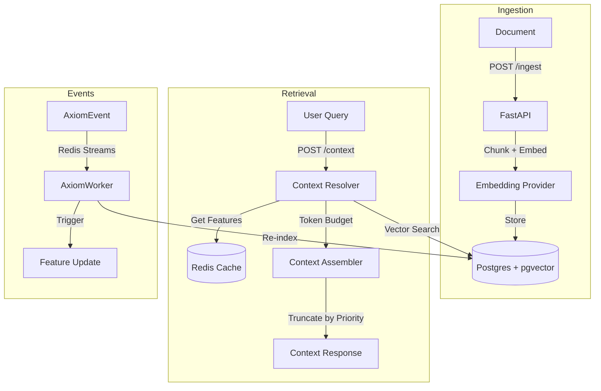
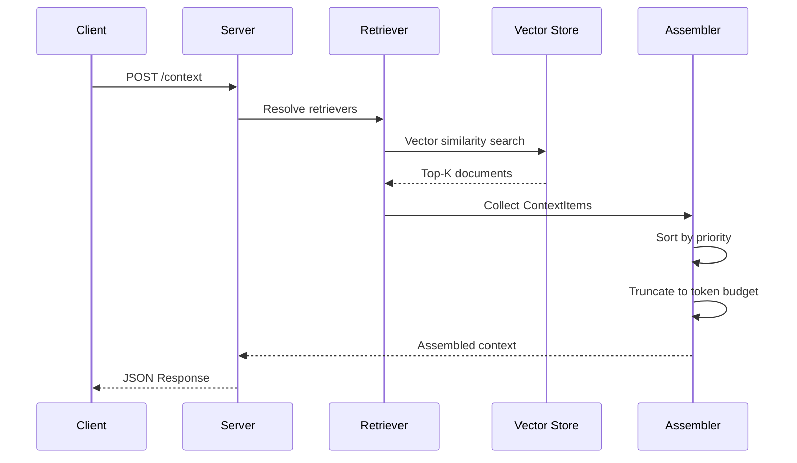

# Fabra Architecture: Boring Technology, Properly Applied

> **TL;DR:** Fabra uses DuckDB and in-memory dicts for local development (no deps) and standard Postgres + Redis + pgvector for production. It guarantees point-in-time correctness for ML features and intelligent context assembly for LLMs—all without Kubernetes.

## Design Philosophy

1. **Redis-Only Caching (No L1)**
   - Most feature stores use in-memory L1 + Redis L2
   - This creates cache coherence bugs (pods see stale values)
   - We use Redis-only: 1ms localhost latency, strong consistency
   - Correctness > micro-optimization for fraud/finance

2. **Randomized Distributed Locking (No Leader Election)**
   - Most systems use consistent hashing or leader election
   - We use randomized work selection + Redis SETNX locks
   - Self-healing, no topology awareness required
   - "Even enough" statistically, brutally simple

3. **Explicit Over Magic**
   - No auto-caching hot features
   - No query optimization
   - User writes `materialize=True`, we cache. That's it.
   - Predictability > cleverness

## The Stack

**Local Mode:**
- **Offline:** DuckDB (embedded SQL engine)
- **Online:** Python dict (in-memory)
- **Scheduler:** APScheduler (background thread)
- **Infrastructure:** None (Just `pip install`)

**Production Mode:**
- **Offline:** Postgres 13+ (Async with `asyncpg`)
- **Online:** Redis 6+ (standalone or cluster)
- **Vector:** pgvector extension for embeddings
- **Scheduler:** Distributed Workers with Redis Locks
- **Infrastructure:** 1x Postgres (with pgvector), 1x Redis, Nx API Pods

## Point-in-Time Correctness

Training/serving skew is the #1 killer of ML models in production.

**Problem:** Your model trains on Monday's features but serves Tuesday's features.

**Solution:** Fabra's `get_training_data()` uses "as-of" joins to ensure zero leakage.

### DuckDB (Development)
Uses native `ASOF JOIN` for high performance:
```sql
SELECT e.*, f.value
FROM entity_df e
ASOF LEFT JOIN feature_table f
ON e.entity_id = f.entity_id AND e.timestamp >= f.timestamp
```

### Postgres (Production)
Uses `LATERAL JOIN` for standard SQL compatibility:
```sql
LEFT JOIN LATERAL (
    SELECT value FROM feature_table f
    WHERE f.entity_id = e.entity_id AND f.timestamp <= e.timestamp
    ORDER BY f.timestamp DESC LIMIT 1
) f ON TRUE
```

Same logic offline (training) and online (serving). Guaranteed consistency.

## Hybrid Retrieval (Python + SQL)

Fabra supports a unique hybrid architecture:
1.  **Python Features:** Computed on-the-fly (Online) or via `apply()` (Offline).
2.  **SQL Features:** Computed via SQL queries (Offline) and materialized to Redis (Online).
3.  **Unified API:** `get_training_data` automatically orchestrates both and joins the results.

## Feature Store Architecture

```mermaid
graph TD
    User[User/Data Scientist] -->|Defines| Code[Feature Definitions]
    Code -->|Registers| Registry[Feature Registry]
    Registry -->|Configures| Scheduler
    Scheduler -->|Triggers| Materialization[Materialization Job]
    Materialization -->|Reads| Offline[Offline Store (DuckDB/Postgres)]
    Materialization -->|Writes| Online[Online Store (Redis/Memory)]
    API[FastAPI Server] -->|Reads| Online
    API -->|Returns| Client[Client App]
```

## Context Store Architecture (New in v1.2.0)

The Context Store extends Fabra to support LLM applications with RAG, vector search, and intelligent context assembly.

### Components

1. **Index Registry:** Manages document collections with automatic chunking (tiktoken) and embedding (OpenAI/Cohere).
2. **Vector Store:** pgvector extension in Postgres for semantic similarity search.
3. **Retrievers:** `@retriever` decorated functions that perform vector search with result caching.
4. **Context Assembly:** `@context` decorated functions that compose retrievers with token budgets.
5. **Event Bus:** Redis Streams for real-time document ingestion and trigger-based updates.

### Context Store Diagram



### Request Lifecycle



### Token Budget Management

Context assembly uses priority-based truncation to fit within LLM token limits:

```python
@context(store, max_tokens=4000)
async def chat_context(user_id: str, query: str):
    return [
        ContextItem(content=system_prompt, priority=0, required=True),  # Never truncated
        ContextItem(content=relevant_docs, priority=1, required=True), # Required, high priority
        ContextItem(content=user_history, priority=2),                 # Optional, medium priority
        ContextItem(content=suggestions, priority=3),                  # Optional, low priority (truncated first)
    ]
```

Items are sorted by priority (lowest first), and lower-priority items are truncated when the budget is exceeded. Items marked `required=True` raise `ContextBudgetError` if they cannot fit.

<script type="application/ld+json">
{
  "@context": "https://schema.org",
  "@type": "TechArticle",
  "headline": "Fabra Architecture: Local-First Feature Store & Context Store Design",
  "description": "Technical deep-dive into Fabra's architecture, explaining the use of DuckDB for local development and Postgres/Redis/pgvector for production ML features and LLM context without Kubernetes.",
  "author": {"@type": "Organization", "name": "Fabra Team"},
  "keywords": "feature store architecture, context store, duckdb, redis, pgvector, mlops, rag",
  "articleSection": "Software Architecture"
}
</script>
