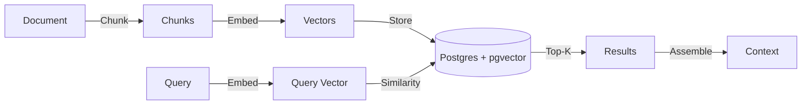

# Context Store for LLMs

> **TL;DR:** Meridian's Context Store is RAG infrastructure that actually works. Index documents, search with pgvector, and assemble context with token budgets—all with Python decorators.

## Why Context Store?

Building LLM applications requires more than just features. You need:

1. **Document Indexing:** Store and chunk documents for retrieval.
2. **Vector Search:** Find semantically relevant content.
3. **Context Assembly:** Combine retrieved docs with user data under token limits.
4. **Freshness:** Update context when documents change.

Most teams cobble together Pinecone + LangChain + custom glue code. Meridian provides all of this in one unified system that shares infrastructure with your Feature Store.

## Quick Example

```python
from meridian.core import FeatureStore
from meridian.context import context, Context, ContextItem
from meridian.retrieval import retriever

store = FeatureStore()

# 1. Define a retriever for semantic search
@retriever(name="docs_search", backend="postgres")
async def search_docs(query: str) -> list[str]:
    # Logic to search your index (e.g. using a pgvector client)
    # The @retriever decorator handles caching and DAG resolution.
    return [] # Implement actual search here

# 2. Define context assembly with token budget
@context(store, max_tokens=4000)
async def chat_context(user_id: str, query: str) -> list[ContextItem]:
    docs = await search_docs(query)
    # Access store instance via global or closure if needed
    user_prefs = await store.get_feature("user_preferences", user_id)

    return [
        ContextItem("You are a helpful assistant.", priority=0, required=True),
        ContextItem(str(docs), priority=1, required=True),
        ContextItem(f"User preferences: {user_prefs}", priority=2),
    ]
```

## Core Concepts

### 1. Indexes

An **Index** is a collection of documents stored with vector embeddings for semantic search.

```python
# Index documents via API
await store.index(
    index_name="knowledge_base",
    entity_id="doc_123",
    text="Meridian is a feature store and context store...",
    metadata={"source": "docs", "version": "1.2.0"}
)
```

Or via HTTP:
```bash
curl -X POST http://localhost:8000/ingest/document \
  -H "Content-Type: application/json" \
  -d '{
    "index_name": "knowledge_base",
    "entity_id": "doc_123",
    "text": "Meridian is a feature store...",
    "metadata": {"source": "docs"}
  }'
```

**Automatic Features:**
- **Chunking:** Documents are split using tiktoken (default: 512 tokens per chunk).
- **Embedding:** Chunks are embedded using OpenAI or Cohere (configurable).
- **Storage:** Embeddings stored in Postgres with pgvector extension.

**Management via CLI:**
```bash
# Manually create an index
meridian index create knowledge_base --dimension 1536

# Check index status
meridian index status knowledge_base
# Output: Index: knowledge_base | Rows: 1542
```

### 2. Retrievers

A **Retriever** performs vector search and returns relevant documents.

```python
from meridian.retrieval import retriever

@retriever(name="knowledge_base", cache_ttl=300)
async def search_docs(query: str) -> list[str]:
    # The decorator handles:
    # 1. Caching results in Redis for cache_ttl seconds
    # 2. DAG resolution if used in templates
    # You implement the actual search logic here.
    return []
```

**Parameters:**
- `cache_ttl`: Seconds to cache results (default: 0, no caching).

[Learn more about Retrievers →](retrievers.md)

### 3. Context Assembly

A **Context** combines multiple sources under a token budget.

```python
from meridian.context import context, ContextItem

@context(store, max_tokens=4000)
async def chat_context(user_id: str, query: str) -> list[ContextItem]:
    # Fetch from multiple sources
    docs = await search_docs(query)
    history = await get_chat_history(user_id)

    return [
        ContextItem(system_prompt, priority=0, required=True),
        ContextItem(str(docs), priority=1, required=True),
        ContextItem(history, priority=2),  # Truncated first if over budget
    ]
```

**Example: Multiple Retrievers**

```python
@retriever(name="products_search")
async def search_products(query: str) -> list[str]:
    # Implement product search logic here
    return []

@retriever(name="tickets_search")
async def search_tickets(query: str) -> list[str]:
    # Implement ticket search logic here
    return []

# Combine in context assembly
@context(store, max_tokens=4000)
async def support_context(query: str) -> list[ContextItem]:
    products = await search_products(query)
    tickets = await search_tickets(query)
    return [
        ContextItem(str(products), priority=1),
        ContextItem(str(tickets), priority=2),
    ]
```

**Priority-Based Truncation:**
- Items sorted by priority (0 = highest priority, kept first).
- Lower-priority items truncated when budget exceeded.
- `required=True` items raise `ContextBudgetError` (or return partial context with warning) if they can't fit.

[Learn more about Context Assembly →](context-assembly.md)

<script type="application/ld+json">
{
  "@context": "https://schema.org",
  "@type": "TechArticle",
  "headline": "Meridian Context Store: RAG Infrastructure for Developers",
  "description": "Complete guide to the Meridian Context Store. Manage vector embeddings, token budgets, and context assembly for Large Language Models.",
  "articleSection": "Context Store",
  "keywords": "context store, rag, vector database, pgvector, llm token management, context assembly",
  "author": {
    "@type": "Person",
    "name": "David Ahmann"
  }
}
</script>

### 4. Event-Driven Updates

Keep context fresh by triggering updates on events.

```python
from meridian.core import feature

@feature(entity=Document, trigger="document_updated")
async def doc_summary(doc_id: str, event: AxiomEvent) -> str:
    # Re-compute summary when document changes
    return summarize(event.payload["content"])
```

Events are published via Redis Streams and consumed by `AxiomWorker`.

**Monitor Events:**
```bash
# Tail the event stream in real-time
meridian events listen --stream document_updated
```

[Learn more about Event-Driven Features →](event-driven-features.md)

## Configuration

| Variable | Description | Default |
| :--- | :--- | :--- |
| `OPENAI_API_KEY` | API key for OpenAI embeddings | Required for embeddings |
| `COHERE_API_KEY` | API key for Cohere embeddings (alternative) | Optional |
| `MERIDIAN_EMBEDDING_MODEL` | Embedding model to use | `text-embedding-3-small` |
| `MERIDIAN_CHUNK_SIZE` | Tokens per chunk | `512` |

### Production Tuning

| Variable | Description | Recommendation |
| :--- | :--- | :--- |
| `MERIDIAN_EMBEDDING_CONCURRENCY` | Max concurrent embedding requests | Set to `20+` if you have high Tier limits. Default `10`. |
| `MERIDIAN_PG_POOL_SIZE` | Postgres Connection Pool Size | Set to `10-20` for high-throughput API pods. Default `5`. |
| `MERIDIAN_PG_MAX_OVERFLOW` | Postgres Connection Pool Overflow | Set to `20+` to handle spikes. Default `10`. |

## Architecture



## When to Use Context Store

**Use Context Store when:**
- Building RAG chatbots or Q&A systems
- Need semantic search over documents
- Want unified infrastructure for features + context
- Need token budget management for LLM prompts

**Use Feature Store alone when:**
- Building traditional ML models
- Only need numerical/categorical features
- No document retrieval required

## Next Steps

- [Retrievers](retrievers.md): Deep dive into vector search
- [Context Assembly](context-assembly.md): Token budgets and priority
- [Event-Driven Features](event-driven-features.md): Real-time updates
- [Use Case: RAG Chatbot](use-cases/rag-chatbot.md): End-to-end example

## 🐛 Debugging & Tracing

Meridian provides built-in observability for your context assembly. Because context is often assembled from multiple stochastic sources (vector search, cached features), understanding *why* a specific prompt was built is crucial.

### The `meridian context explain` Command

You can trace any context request by its ID:

```bash
meridian context explain ctx_12345
```

**Output:**
```json
{
  "context_id": "ctx_12345",
  "created_at": "2025-12-08T21:00:00Z",
  "latency_ms": 45.2,
  "token_usage": 3450,
  "cost_usd": 0.002,
  "freshness_status": "guaranteed",
  "source_ids": ["doc_123", "user_prefs_456"],
  "stale_sources": [],
  "cache_hit": false,
  "meta": {
    "dropped_items": 1,
    "budget_exceeded": false
  }
}
```

<script type="application/ld+json">
{
  "@context": "https://schema.org",
  "@type": "TechArticle",
  "headline": "Context Store for LLMs: RAG Infrastructure",
  "description": "Build production RAG applications with Meridian's Context Store. Vector search with pgvector, automatic chunking, token budgets, and priority-based context assembly.",
  "author": {"@type": "Organization", "name": "Meridian Team"},
  "keywords": "context store, rag, llm, pgvector, vector search",
  "articleSection": "Documentation"
}
</script>
